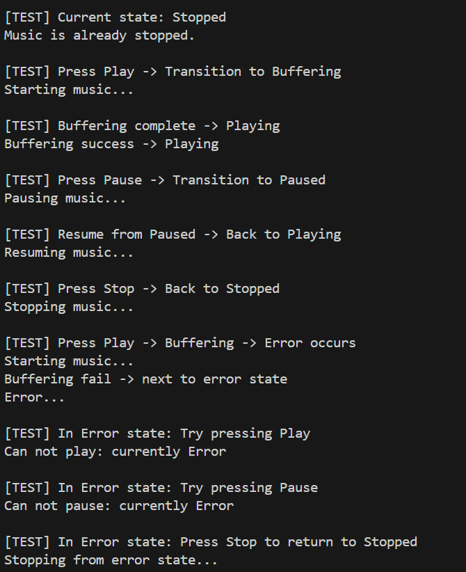

# Music Player State Pattern

## 1. Mô tả dự án
Thiết kế phần mềm trình phát nhạc đơn giản sử dụng State Pattern. Trình phát nhạc có các trạng thái: Đang dừng (Stopped), Đang phát (Playing), Đang tạm dừng (Paused). Hành vi của các nút điều khiển (Play, Pause, Stop) thay đổi tùy theo trạng thái hiện tại. Mục tiêu là giúp MusicPlayer thay đổi linh hoạt hành vi khi trạng thái thay đổi, dễ dàng mở rộng thêm trạng thái mới mà không ảnh hưởng đến mã nguồn hiện tại.

## 2. Cấu trúc source code
```
03-state-machince/
├── main.c                
├── Makefile              
├── inc/                 
│   ├── musicPlayer.h        
│   ├── playerState.h         
│   ├── stoppedState.h        
│   ├── playingState.h      
│   ├── pausedState.h        
│   └── ...                  
├── src/                
│   ├── musicPlayer.c       
│   ├── stoppedState.c        
│   ├── playingState.c        
│   ├── pausedState.c         
│   └── ...                  
```

## 3. Các API, struct, element chính
- **MusicPlayer (Context):**
  - Quản lý trạng thái hiện tại, cung cấp các hàm clickPlayButton(), clickPauseButton(), clickStopButton().
  - Hàm changeState() để chuyển đổi trạng thái.
- **PlayerState (Interface):**
  - Định nghĩa các hàm: pressPlay(), pressPause(), pressStop().
  - Có thể có setContext() để liên kết với MusicPlayer.
- **StoppedState, PlayingState, PausedState (ConcreteState):**
  - Triển khai PlayerState, định nghĩa hành vi cụ thể cho từng trạng thái.
  - Có thể gọi changeState() để chuyển trạng thái cho MusicPlayer.

## 4. How to build & run
```bash
# Build project
make

# Chạy chương trình
./main
```

## 5. Kết quả mẫu


## 6. Mở rộng
- Dễ dàng thêm trạng thái mới như BufferingState, ErrorState chỉ bằng cách thêm file .h/.c tương ứng và cập nhật Makefile.
- Quản lý code rõ ràng, dễ bảo trì, mở rộng.
