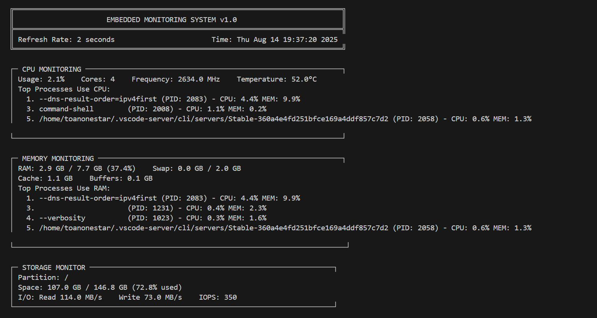
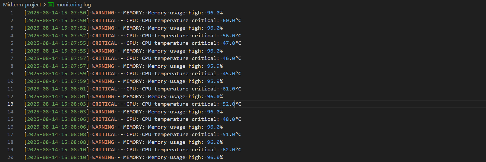

# 🖥️ Embedded Monitoring System

[](https://github.com/your-repo/embedded-monitoring)
[](https://github.com/your-repo/embedded-monitoring)
[](https://en.wikipedia.org/wiki/C_(programming_language))

## 📖 Mô tả dự án

**Hệ thống Giám sát Tích hợp máy tính nhúng** là một giải pháp giám sát toàn diện được thiết kế để theo dõi và phân tích thời gian thực các thông số hoạt động của hệ thống Linux embedded.

### 🎯 Bài toán giải quyết:
- **Giám sát real-time**: Thu thập và hiển thị các thông số hệ thống liên tục
- **Cảnh báo thông minh**: Phát hiện và thông báo khi vượt ngưỡng an toàn
- **Tích hợp dữ liệu**: Cung cấp API để tích hợp với các hệ thống giám sát khác
- **Quản lý cấu hình**: Cho phép tùy chỉnh ngưỡng cảnh báo và các tham số

### 📊 Các thông số giám sát:

#### 🔹 CPU Monitoring
- Phần trăm sử dụng CPU tổng thể và theo từng core
- Tần số hoạt động hiện tại (MHz)
- Nhiệt độ CPU (°C)
- Top 5 tiến trình sử dụng CPU cao nhất

#### 🔹 Memory Monitoring  
- RAM đã sử dụng/còn trống (GB)
- Swap usage và cache information
- Top 5 tiến trình sử dụng RAM nhiều nhất
- Memory buffers và cached data

#### 🔹 Storage Monitoring
- Dung lượng đã sử dụng/còn trống của các phân vùng
- Tốc độ đọc/ghi (MB/s)
- IOPS (Input/Output Operations Per Second)
- I/O statistics chi tiết

#### 🔹 Network Monitoring
- Tốc độ upload/download hiện tại (KB/s)
- Băng thông sử dụng tổng cộng
- Số lượng kết nối đang hoạt động
- Thống kê các network interfaces và IP addresses

#### 🔹 System Monitoring
- Thời gian hoạt động (uptime) của hệ thống
- Load average (1, 5, 15 phút)
- Phiên bản kernel hiện tại
- Số lượng services đang chạy

### 🚨 Tính năng cảnh báo:
- **3 mức độ cảnh báo**: INFO, WARNING, CRITICAL
- **Ngưỡng tùy chỉnh** cho từng thông số
- **Thông báo âm thanh** cho cảnh báo critical
- **Logging tự động** với timestamp
- **Real-time notifications** qua Observer pattern

---

## 📁 Cấu trúc Source Code

```
.
├── inc
│   ├── common.h
│   ├── factory.h
│   ├── monitor
│   │   ├── cpu-monitor.h
│   │   ├── memory-monitor.h
│   │   ├── monitor.h
│   │   ├── network-monitor.h
│   │   ├── storage-monitor.h
│   │   └── system-monitor.h
│   └── observer
│       ├── api-observer.h
│       ├── config.h
│       ├── console-observer.h
│       ├── logger-observer.h
│       ├── monitoring-system.h
│       └── observer.h
└── src
    ├── factory.c
    ├── monitor
    │   ├── cpu-monitor.c
    │   ├── memory-monitor.c
    │   ├── monitor.c
    │   ├── network-monitor.c
    │   ├── storage-monitor.c
    │   └── system-monitor.c
    └── observer
        ├── api-observer.c
        ├── config.c
        ├── console-observer.c
        ├── logger-observer.c
        ├── monitoring-system.c
        └── observer.c
├── main.c
├── Makefile
├── README.md
```

---

## 🧩 API, Struct và Element chính

### 🏗️ Design Patterns sử dụng:

#### 1️⃣ **Factory Pattern**
```c
typedef struct {
    Monitor* (*create_monitor)(MonitorType type);
} MonitorFactory;

// Usage: factory.create_monitor(MONITOR_CPU);
```

#### 2️⃣ **Observer Pattern**  
```c
struct Observer {
    void (*update)(Observer* self, Subject* subject, void* data);
    char name[MAX_STRING_LEN];
};

struct Subject {
    Observer* observers[MAX_OBSERVERS];
    void (*attach)(Subject* self, Observer* observer);
    void (*notify)(Subject* self, void* data);
};
```

### 📊 Core Data Structures:

#### **CPUData**
```c
typedef struct {
    float total_usage;           // Tổng % CPU usage
    float core_usage[8];         // Usage theo từng core
    int core_count;              // Số lượng cores
    float frequency;             // Tần số hoạt động (MHz)
    float temperature;           // Nhiệt độ CPU (°C)
    ProcessInfo top_processes[5]; // Top 5 processes
} CPUData;
```

#### **MemoryData**
```c
typedef struct {
    unsigned long total_ram;     // Tổng RAM (bytes)
    unsigned long used_ram;      // RAM đang sử dụng
    unsigned long free_ram;      // RAM còn trống
    unsigned long swap_total;    // Tổng swap space
    unsigned long swap_used;     // Swap đang sử dụng
    unsigned long cache;         // Memory cache
    unsigned long buffers;       // Memory buffers
    ProcessInfo top_memory_processes[5]; // Top memory processes
} MemoryData;
```

#### **NetworkInterface**
```c
typedef struct {
    char interface[256];         // Tên interface (eth0, wlan0...)
    char ip_address[16];         // IP address
    unsigned long bytes_sent;    // Bytes đã gửi
    unsigned long bytes_recv;    // Bytes đã nhận
    float upload_speed;          // Tốc độ upload (KB/s)
    float download_speed;        // Tốc độ download (KB/s)
} NetworkInterface;
```

#### **AlertData**
```c
typedef struct {
    AlertLevel level;            // INFO, WARNING, CRITICAL
    char message[256];           // Nội dung cảnh báo
    time_t timestamp;            // Thời gian phát sinh
    MonitorType source;          // Nguồn cảnh báo (CPU, Memory...)
} AlertData;
```

### 🔧 Core APIs:

#### **MonitorFactory API**
```c
Monitor* create_monitor(MonitorType type);  // Tạo monitor theo type
```

#### **Monitor API**
```c
void start(Monitor* self);                  // Bắt đầu monitoring
void stop(Monitor* self);                   // Dừng monitoring
void collect_data(Monitor* self);           // Thu thập dữ liệu
```

#### **Observer API**
```c
void attach(Subject* self, Observer* obs);  // Đăng ký observer
void notify(Subject* self, void* data);     // Thông báo thay đổi
void update(Observer* self, void* data);    // Xử lý thông báo
```

#### **Configuration API**
```c
SystemConfig* load_config(const char* file); // Load cấu hình
void save_config(SystemConfig* cfg, const char* file); // Save cấu hình
```

### 🎛️ Monitor Types:
```c
typedef enum {
    MONITOR_CPU,        // CPU monitoring
    MONITOR_MEMORY,     // Memory monitoring  
    MONITOR_STORAGE,    // Storage monitoring
    MONITOR_NETWORK,    // Network monitoring
    MONITOR_SYSTEM      // System monitoring
} MonitorType;
```

### 📱 Observer Types:
- **ConsoleObserver**: Hiển thị real-time trên console
- **LoggerObserver**: Ghi log ra file với timestamp
- **APIObserver**: Cung cấp REST API endpoints

---

## 🚀 How to Build & Run

### 📋 Yêu cầu hệ thống:
- **OS**: Linux (Ubuntu/CentOS/Debian)
- **Compiler**: GCC với C99 support
- **Libraries**: pthread, sys/sysinfo.h, ifaddrs.h
- **RAM**: Minimum 512MB
- **Storage**: 50MB free space

### ⚡ **Build project**
```bash
make
```
*Compile toàn bộ source code và tạo executable*

#### 4️⃣ **Run monitoring system**
```bash
./monitoring_system
```

### 🛠️ Kết quả


Kiểm tra các log cảnh báo ở file ```monitoring.log```:

### ⚙️ Runtime Controls:

Khi chạy chương trình, sử dụng các phím:
- **`q`** hoặc **`Q`**: Thoát chương trình
- **`c`** hoặc **`C`**: Lưu cấu hình hiện tại
- **`r`** hoặc **`R`**: Reload cấu hình từ file
- **`Ctrl+C`**: Graceful shutdown

### 📝 Configuration File:

Tạo file `monitoring.conf`:
```ini
# Embedded Monitoring System Configuration
cpu_threshold=80.0
memory_threshold=85.0
storage_threshold=90.0
bandwidth_threshold=1000.0
temperature_threshold=70.0
refresh_interval=2
log_file=monitoring.log
api_port=8080
```

### 🔍 Kiểm tra logs:
```bash
# Xem real-time logs
tail -f monitoring.log

# Xem alerts trong ngày
grep "$(date '+%Y-%m-%d')" monitoring.log

# Xem critical alerts
grep "CRITICAL" monitoring.log
```
---

## 📚 Advanced Usage

### 🎨 Customization:

#### Thêm Monitor mới:
1. Tạo `new_monitor.h` và `new_monitor.c`
2. Implement interface từ `monitor.h`
3. Thêm vào `factory.c`
4. Update `MonitorType` enum

#### Thêm Observer mới:
1. Tạo `new_observer.h` và `new_observer.c` 
2. Implement `Observer` interface
3. Attach vào monitors cần thiết

### 🔧 Troubleshooting:

#### Build errors:
```bash
# Install missing dependencies (Ubuntu/Debian)
sudo apt-get install build-essential libc6-dev

# Install missing dependencies (CentOS/RHEL)
sudo yum install gcc glibc-devel
```

#### Permission errors:
```bash
# Run with appropriate permissions
sudo ./monitoring_system

# Or add user to required groups
sudo usermod -a -G adm $USER
```

#### Memory issues:
```bash
# Check system resources
free -h
df -h

# Run with lower refresh rate
# Edit monitoring.conf: refresh_interval=5
```

---

## 👥 Authors

- **ToanOneStar** - HUST - [YourGithub](https://github.com/ToanOneStar)

---

## 🙏 Acknowledgments

- Linux kernel documentation
- System monitoring best practices
- Open source community contributions
- Design patterns implementation references

---

**⭐ Star this repo if you found it helpful!**